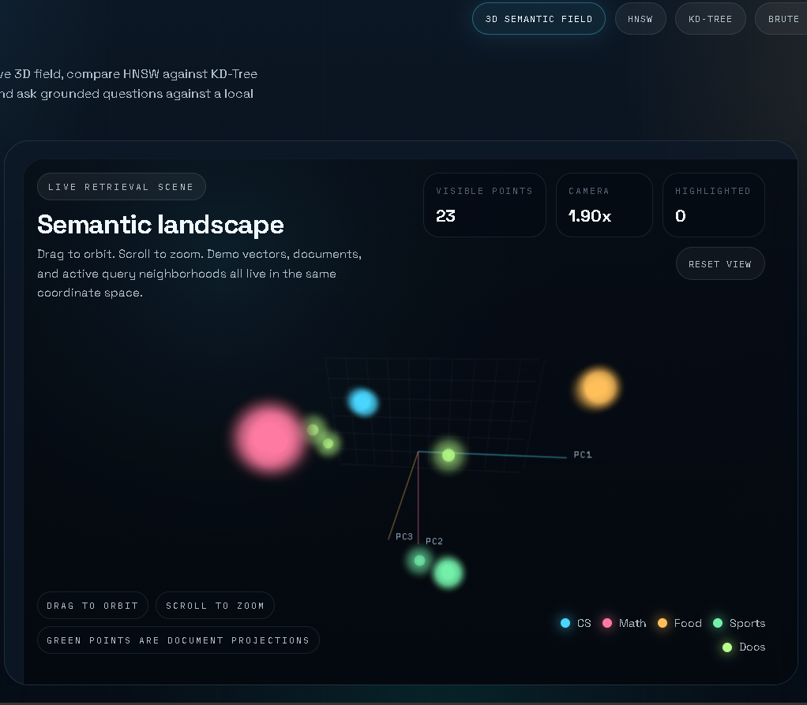
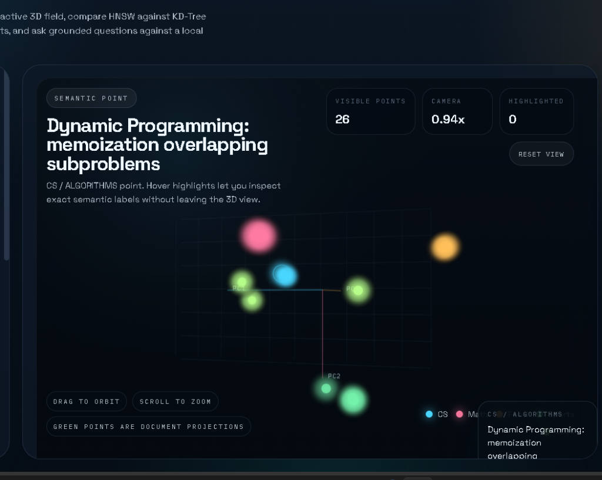

# PragnaAI — 3D Vector Retrieval Studio (MERN Stack & C++)

A high-performance, local-first **Vector Database and Retrieval Studio** combining native C++17 algorithms (HNSW, KD-Tree, and Brute Force) with a modern **React (Vite) + Express (Node.js)** full-stack architecture. 

It indexes document chunks locally using Ollama embeddings, hosts an orbitable 3D PCA semantic visualization cockpit, and powers a grounded **Retrieval-Augmented Generation (RAG)** QA assistant completely offline.

> 📚 **Looking for placement preparation?** Check out the detailed, pointwise [Technical Wiki & Interview Guide](WIKI.md) which breaks down HNSW/KD-Tree mechanics, mathematical distance metrics, client-side PCA SVD power iteration, and contains 10 comprehensive technical interview questions.

---

## 📸 Interactive Visual Showcase

### 1. 3D Principal Component Analysis (PCA) Cockpit
The dashboard displays high-dimensional vectors projected into a 3D orbitable field in real-time. Hovering over nodes reveals semantic metadata, categorical indices, and link mappings.


### 2. Retrieval-Grounded RAG Assistant
Interrogate your local documents. When a question is asked, the engine embeds the query, traverses the C++ HNSW graph, retrieves the top-K relevant text chunks, and feeds them into local LLM inference context with zero data leakage.


---

## ⚡ Why This Project Stands Out (For Interviewers)

Most full-stack AI portfolios are simple wrappers around cloud APIs (OpenAI, Pinecone) or bulky Python frameworks (LangChain, LlamaIndex). **PragnaAI was built from first principles**:

1.  **C++ Core Engine from Scratch**: The HNSW Hierarchical graph skip-connections, KD-Tree space partitioning, Euclidean/Cosine distance metrics, and the custom binary serialization database are written purely in native C++17.
2.  **Decoupled Systems Architecture**: Implements a standard MERN concurrent pattern. The Node.js event-loop serves static files and manages network processes, while spawning and proxying to the C++ server as a background microservice.
3.  **No Bulky 3D Engines**: Instead of using heavy WebGL libraries like Three.js, the 3D cockpit is drawn on a raw HTML5 2D Canvas. Yaw-pitch camera rotation, perspective projection scaling, depth transparency, and raycast mouse hover detection are implemented in pure JavaScript.
4.  **Client-Side PCA Solver**: The 768-dimensional text embeddings are projected to 3D coordinates locally using a custom Singular Value Decomposition (SVD/Power Iteration) script with Gram-Schmidt orthogonalization.

---

## 🔍 Code Inspection Guide (Quick Evaluation)

If you are an interviewer looking to review code structure, here are the core entry points:

*   [main.cpp](main.cpp): Native HNSW graph structures, KD-Tree cycle splits, custom binary serialization (`saveToFileUnlocked`/`loadFromFileUnlocked`), and HTTP API routes.
*   [backend/server.js](backend/server.js): Subprocess life-cycle management (preventing orphaned background ports), API gateway proxying, and background PDF file parsing.
*   [frontend/src/utils/pca.js](frontend/src/utils/pca.js): Client-side PCA implementation containing the dot product, vector normalization, Gram-Schmidt orthogonalization, and power iteration algorithms.
*   [frontend/src/components/PcaCanvas.jsx](frontend/src/components/PcaCanvas.jsx): Orbit-camera angle rotation calculations, depth transparency rendering, perspective transformation equations, and zero-latency mouse coordinates raycasting.

---

## Key Features

| Feature | Description |
|---|---|
| **High-Performance C++ Core** | Native implementation of HNSW (multilayer graph), KD-Tree, and Brute Force KNN search. |
| **Express API Gateway** | Orchestrates Ollama embeddings, document ingestion, and serves as a proxy/gateway on port `8080`. |
| **Interactive 3D Orbit Cockpit** | React SPA visualizes high-dimensional semantic spaces projected to 3D via Principal Component Analysis (PCA). |
| **Auto-Indexing Directory** | Drop `.txt`, `.md`, or `.pdf` files into the `documents/` folder; they are parsed, embedded, and indexed on server startup automatically. |
| **Offline Grounded RAG** | Ask questions → HNSW retrieves context → local Llama 3.2 generates responses with zero data leaving your machine. |
| **Performance Benchmarks** | Compare search latency between HNSW, KD-Tree, and Brute Force side-by-side. |

---

## Architectural Layout

```
                        ┌──────────────────────────────┐
                        │      React (Vite) Client     │
                        │    http://localhost:8080     │
                        └──────────────┬───────────────┘
                                       │
                                       ▼ (API Requests / Static Assets)
                        ┌──────────────────────────────┐
                        │    Express API Gateway (Node)│
                        │         Port: 8080           │
                        └──────────────┬───────────────┘
                                       │
                ┌──────────────────────┴──────────────────────┐
                ▼ (Proxy Vector APIs)                         ▼ (Generate Embeddings & RAG)
┌──────────────────────────────┐              ┌──────────────────────────────┐
│  C++ Vector Search Engine    │              │          Ollama API          │
│       Port: 8081 (db.exe)    │              │       Port: 11434 (Local)    │
└──────────────────────────────┘              └──────────────────────────────┘
```

---

## Prerequisites

Ensure you have these tools installed:

1. **Node.js** (v18 or higher)
2. **Git**
3. **MSYS2** (for `g++` compilation on Windows)
4. **Ollama** (for local AI models)

### Prepare Ollama Models
Before running the application, pull the embedding and LLM models from your terminal:
```bash
ollama pull nomic-embed-text
ollama pull llama3.2
```

---

## Step-by-Step Setup & Compilation

### Step 1 — MSYS2 (g++ Compiler) Setup (Windows)
1. Download the installer from [msys2.org](https://www.msys2.org).
2. Run it and keep the default installation path (`C:\msys64`).
3. Open **MSYS2 UCRT64** terminal and install gcc/g++:
   ```bash
   pacman -Syu
   pacman -S mingw-w64-ucrt-x86_64-gcc
   ```
4. Add `C:\msys64\ucrt64\bin` to your Windows System environment **PATH** variable.
5. Verify compiler access in PowerShell:
   ```powershell
   g++ --version
   ```

### Step 2 — Clone the Repository
```bash
git clone https://github.com/shibchandan/PragnaAI.git
cd PragnaAI
```

### Step 3 — Install Dependencies
Install dependencies globally for the root concurrently scripts, front-end client, and Express server:
```bash
npm run install-all
```

### Step 4 — Compile and Build
Compile the C++ backend and bundle the React production static assets:
```bash
npm run build-all
```

---

## Running the Application

To start the application, run:
```bash
npm start
```
This single command:
1. Starts the Express server on port `8080`.
2. Automatically spawns the compiled C++ vector database (`db.exe`) as a microservice on port `8081`.
3. Auto-scans the `documents/` folder and indexes available documents.
4. Opens your default web browser automatically to `http://localhost:8080`.

To run the project in development mode with React hot-reloading:
```bash
npm run dev
```

---

## Auto-Indexing Documents
Any text files (`.txt`), Markdown files (`.md`), or PDF files (`.pdf`) placed inside the `documents/` directory at the project root will be read on startup.
- If the directory is missing, Express will automatically create it and seed it with three sample guides: `about_pragna_ai.txt`, `vector_embeddings_basics.txt`, and `grounded_rag_intro.txt`.
- Chunks and embeddings are generated using Ollama and indexed in the C++ memory graph automatically.

---

## 🛠️ Direct API Testing (Verification Guide)

If you'd like to query the database endpoints directly via shell, you can bypass the front-end completely.

### 1. Vector Database Endpoints (16D Demo Space)
*   **List all active vectors**:
    ```bash
    curl http://localhost:8080/items
    ```
*   **Search for nearest neighbors (Cosine, KD-Tree)**:
    ```bash
    curl "http://localhost:8080/search?v=0.9,0.8,0.7,0.6,0.1,0.1,0.1,0.1,0.1,0.1,0.1,0.1,0.1,0.1,0.1,0.1&k=3&metric=cosine&algo=kdtree"
    ```
*   **Compare algorithms latency (HNSW vs KD-Tree vs Brute Force)**:
    ```bash
    curl "http://localhost:8080/benchmark?v=0.9,0.8,0.7,0.6,0.1,0.1,0.1,0.1,0.1,0.1,0.1,0.1,0.1,0.1,0.1,0.1&k=3&metric=cosine"
    ```

### 2. Document and Grounded RAG Endpoints (768D Semantic Space)
*   **Check Ollama Connection & Database Size**:
    ```bash
    curl http://localhost:8080/status
    ```
*   **List all indexed document chunks**:
    ```bash
    curl http://localhost:8080/doc/list
    ```
*   **Submit a retrieval-grounded QA prompt**:
    ```bash
    curl -X POST -H "Content-Type: application/json" -d '{"question":"What algorithms are implemented in PragnaAI?", "k":3}' http://localhost:8080/doc/ask
    ```

---

## Project Structure

```
PragnaAI/
├── backend/
│   ├── package.json   ← Express configurations
│   └── server.js      ← Express Gateway and Process Manager
├── frontend/
│   ├── src/           ← React Component and PCA logic
│   └── package.json   ← Vite settings
├── documents/         ← Directory for auto-indexing documents
├── docs/
│   └── images/        ← Embedded visual screenshot walkthroughs
├── ui/                ← Output folder for bundled React assets
├── main.cpp           ← C++ HNSW, KD-Tree, and REST handlers
├── build.ps1          ← Windows C++ compilation script
└── package.json       ← Root concurrently launch controls
```

---

## License
MIT — build, modify, and use it however you want.
